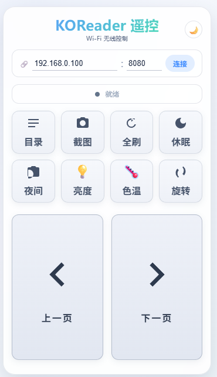

# KOReader 遥控器

一个纯前端（HTML/CSS/JS）的 KOReader 无线遥控页面。手机/电脑浏览器打开即可控制同一 Wi‑Fi 下的 KOReader 阅读器，无需安装、无需后端。

## 在线访问

| 通道 | 链接 | 说明 |
|------|------|------|
| WorkBuddy 在线版 | `https://db6e2b1b140b45d894a0061efd69c39a.app.workbuddy.link` | 一键在线使用，无需任何操作 |
| GitHub Pages | `https://seaneasysaid.github.io/koreader-remote/` | 长期稳定链接，随仓库更新 |

## 界面预览

### 日间模式


*日间模式：低饱和淡蓝灰玻璃态，4×2 功能按钮 + 双大翻页按钮*

> 右上角 ☀️/🌙 可一键切换页面自身的日间/夜间主题（仅影响遥控界面，不影响设备）。

---

## 一、使用前准备（设备端）

1. 查看设备 IP：进入 KOReader **设置 → 网络 → 查看网络信息**，记下设备在本机 Wi‑Fi 下的 **IP 地址**（如 `192.168.0.100`）。
2. 打开 **KOReader HTTP 调试器**，设置监听**端口**（例如 `8080`）。
3. 确保你的手机/电脑与 KOReader 设备在**同一个 Wi‑Fi**（同一网段）下。
4. 浏览器打开本页面。

---

## 二、怎么用

1. 在「设备 IP」框填入 KOReader 的 IP（默认已填 `192.168.0.100`），端口默认 `8080`。
2. 点 **连接** 测试可达性：
   - 显示「连接成功 ✓」即可开始遥控；
   - 超时/被拒绝会给出提示，请核对 IP 与端口、确认服务器已启动。
3. IP 与端口会保存在浏览器本地，下次打开自动回填。

### 遥控功能一览

| 按钮 | 作用 | KOReader 事件 |
|------|------|--------------|
| 上一页 / 下一页 | 翻页 | `GotoViewRel/-1`、`GotoViewRel/1` |
| 目录 | 打开书籍目录 | `ShowToc` |
| 屏幕截图 | 获取设备当前屏幕 PNG 并保存到本机 | `GET /koreader/device/screen/bb` |
| 全刷 | 强制全屏刷新（墨水屏整屏重绘） | `FullRefresh` |
| 休眠 | 让设备进入休眠 | `RequestSuspend` |
| 夜间模式 | 切换设备夜间模式 | `ToggleNightMode` |
| 亮度（💡） | 展开二级弹层，＋1/−1 调节前光亮度 | `IncreaseFlIntensity/1`、`DecreaseFlIntensity/1` |
| 色温（🌡️） | 展开二级弹层，＋1/−1 调节前光色温（长按连发） | `IncreaseFlWarmth/1`、`DecreaseFlWarmth/1` |
| 旋转 | 屏幕顺时针旋转 90° | `IterateRotation` |

> 提示：所有指令都通过 KOReader 的事件名（Event）广播下发，因此**事件名必须与 KOReader 内部事件名完全一致**（驼峰命名）。非原生事件名（如 `Rotate`、`full_refresh`）会无效。

### 键盘 / 翻页笔
- 物理键盘或蓝牙翻页笔（PPT 翻页笔，以 HID 键盘形式工作）可用：
  - `PageUp` / `←` / `↑` → 上一页
  - `PageDown` / `→` / `↓` → 下一页

---

## 三、部署 / 更新到 GitHub Pages

仓库内容即页面源码。任意改动后，把本目录的 `index.html`（页面本体）、`icon-192.png`、`icon-512.png`、`README.md` 推送/上传到仓库根目录即可，GitHub Pages 会自动发布。

```bash
# 若本地已 clone 该仓库，更新页面后：
cp index.html index.html.bak  # 无需，仅为说明
git add index.html icon-192.png icon-512.png README.md
git commit -m "update: 页面/文档更新"
git push origin main
```

- 仓库 **Settings → Pages → Source** 选 **Deploy from a branch**，**Branch** 选 `main`，目录选 **/ (root)**。
- 约 1 分钟后访问 `https://seaneasysaid.github.io/koreader-remote/`。

> 小贴士：把仓库直接命名为 `你的用户名.github.io`，链接会更短：`https://你的用户名.github.io/`。

---

## 四、本地直接打开

本页面为纯静态文件，也可直接双击 `index.html` 用浏览器打开使用（不受跨域限制影响功能，仅「屏幕截图」在 `file://` 下会改为新标签页打开图片，需手动保存）。

---

## 五、说明 / 限制

- 仅支持 KOReader 自带的 HTTP 控制接口，需要设备端开启服务器。
- 遥控指令与目标设备在同一局域网内直连，不经过任何第三方服务器。
- 默认 IP/端口可在 `index.html` 第 216、218 行的 `value` 中修改后重新部署。
